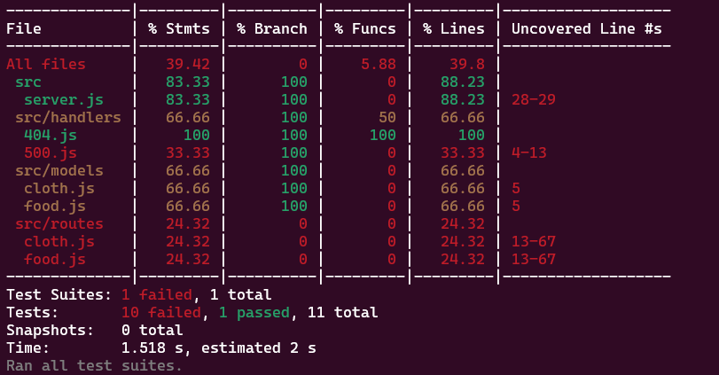
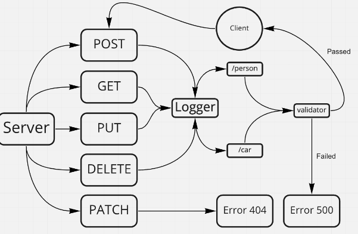

# api-server
LAB3: Express REST API

## Installation and Testing

### How to Install the App or Library?

To install the application, clone the repository to your local machine:

1. Git clone [<https://github.com/QILINXIE02/api-server.git>](https://github.com/QILINXIE02/api-server.git)

2. Install your dependencies – npm install cors dotenv express jest supertest i sequelize sequelize-cli pg sqlite3

3. Test your server – npm test

### Remember to start your Postgres server:
- Windows and Linux Users: pg_ctl -D /home/linuxbrew/.linuxbrew/var/postgres start
- Mac Users: brew services start postgres

tests: 

Lab 3: UML

