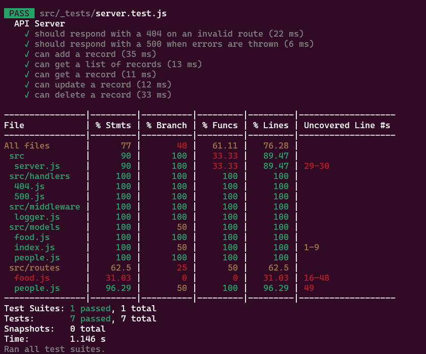

# api-server
LAB3: Express REST API
[class 3: instructor note: README](https://github.com/codefellows/seattle-javascript-401d58/blob/main/class-03/README.md)
- [Render deployment...](https://api-server-yigi.onrender.com/)
- [Render Database created demo](https://dashboard.render.com/d/dpg-cop7piacn0vc73do1mrg-a)
- [Github action link](https://github.com/QILINXIE02/api-server/actions)
- [PR to main](https://github.com/QILINXIE02/api-server/commit/44e54f7ae40991f51d65b317454e0e3008bf9563)

LAb 4: Data Modeling
[class 4: instructor note: README](https://github.com/codefellows/seattle-javascript-401d58/blob/main/class-04/README.md)
- [Render deployment](https://api-server-yigi.onrender.com/)
- [Github action link](https://github.com/QILINXIE02/api-server/actions)
- [PR to main](https://github.com/QILINXIE02/api-server/pull/3)

test screenshot: 

## Installation and Testing

### How to Install the App or Library?

To install the application, clone the repository to your local machine:

1. Git clone [<https://github.com/QILINXIE02/api-server.git>](https://github.com/QILINXIE02/api-server.git)

2. Install your dependencies – npm install cors dotenv express jest supertest i sequelize sequelize-cli pg sqlite3

3. Test your server – npm test

### Remember to start your Postgres server:
- Windows and Linux Users: pg_ctl -D /home/linuxbrew/.linuxbrew/var/postgres start
- Mac Users: brew services start postgres

Lab 3 & 4 : UML

